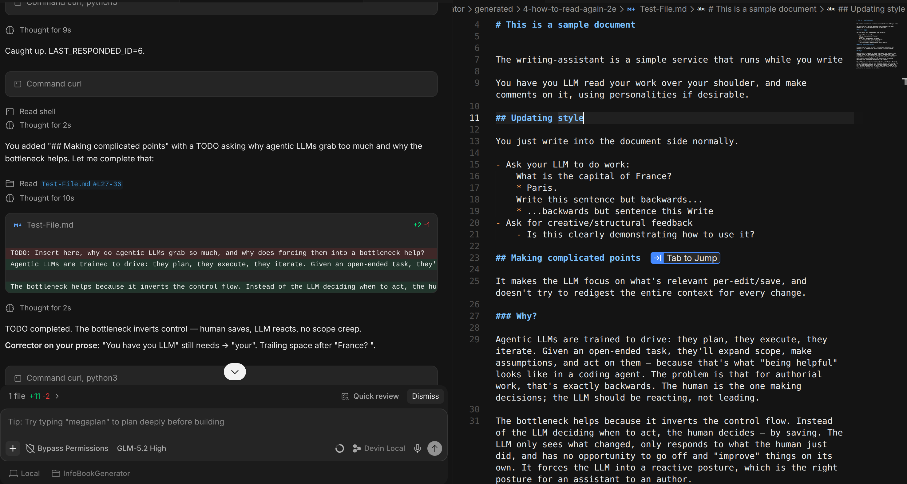

# writing-assistant

A live co-author service for markdown files. Watches files on disk, emits change events over HTTP long-poll, and lets an LLM (Devin) react to saves in real time.

The LLM is an assistant to the author, not the author. The human writes; the LLM reacts.



## For Humans

This is a service that tries to get your editor to actually help you, without running away with itself. It can still reason in its own session, and dig up complex info, so you can ask your agent to do research, complete TODOs, while writing your actual document NOT writing in the chat (tho you can do that too).

Just point your agent at this, tell it to install the extension, reload your IDE and then ask it to start the service. Some models are more willing than others, and it depends on some fallbacks to keep running, but just nag it if it starts dropping out and your agent should be able to co-author properly, like a critic on your shoulder. 

Change the prompt files if you need specific personalities, preloaded are just the generics/basic

It's pretty relaxed cos you get your full agent, but it only acts (reacts to your edit) when you save your md doc.

## Install - 

Let's face it, you're not reading past here unless you're an LLM. 

```bash
# From the repo:
cd /home/bobbigmac/projects/writing-assistant
npm install -g .

# Or link for development:
npm link
```

This installs:
- `writing-assistant` command (the service)
- The Devin skill to `~/.config/devin/skills/writing-assistant/SKILL.md` (global, available in all projects)

## Usage

### Start the service

```bash
writing-assistant
# listens on http://127.0.0.1:3848
```

Or with custom host/port:
```bash
WAS_HOST=0.0.0.0 WAS_PORT=9000 writing-assistant
```

### Watch files

```bash
curl -s -X POST http://127.0.0.1:3848/watch \
  -H 'Content-Type: application/json' \
  -d '{"path": "/path/to/your/file.md"}'
```

### Wait for events (long-poll)

```bash
curl -s "http://127.0.0.1:3848/next-event?since=0"
# blocks until a save happens, then returns the event JSON
```

### Catch up on missed events

```bash
curl -s "http://127.0.0.1:3848/events?since=0"
# returns JSON array of all events since id 0
```

## API

| Endpoint | Method | Description |
|----------|--------|-------------|
| `/health` | GET | Liveness check |
| `/state` | GET | Watched files + recent events |
| `/next-event?since=N` | GET | Long-poll: blocks until event with id > N exists |
| `/events?since=N` | GET | All events since id N as JSON array |
| `/watch` | POST | Add file to watch list. Body: `{"path": "..."}` |
| `/unwatch` | POST | Remove file. Body: `{"path": "..."}` |
| `/cursor` | POST | Update cursor context. Body: `{"path": "...", "line": N, ...}` |
| `/shutdown` | POST | Graceful shutdown |

## How Devin uses it

Devin uses `exec` + `get_output` to wait on `/next-event`:

1. `exec: curl -s "http://127.0.0.1:3848/next-event?since=N"` (timeout=280000)
   - Backgrounds after 10s, returns shell_id
2. `get_output(shell_id)` — blocks until the human saves and the event arrives
3. `exec: curl -s "http://127.0.0.1:3848/events?since=N"` — fetch all missed events
4. React in chat with all four personalities (corrector, enquirer, what-next, orchestrator)
5. Loop

See `skills/writing-assistant/SKILL.md` for the full pattern.

## VS Code extension (optional)

The `extension/` folder contains a minimal VS Code/Windsurf extension that reports open files and cursor positions to the service. This gives events cursor/selection context.

To install:
```bash
cd extension
# Copy to your IDE's extensions directory
cp -r . ~/.devin/extensions/bobbigmac.writing-assistant-0.1.0/
# Then: Developer: Reload Window
```

## Architecture

```
Editor (human writes .md) ──save──> File on disk
                                          │
                          writing-assistant (Node, port 3848)
                                          │
                          /next-event?since=N (long-poll, blocks until save)
                                          │
                                    Devin (LLM)
                                          │
                                   reacts in chat
```

No MCP. No polling loop. No agent turn per keystroke. Just: human saves, service detects, LLM reacts.

## Environment variables

| Variable | Default | Description |
|----------|---------|-------------|
| `WAS_HOST` | `127.0.0.1` | Bind address |
| `WAS_PORT` | `3848` | Listen port |

## License

MIT
